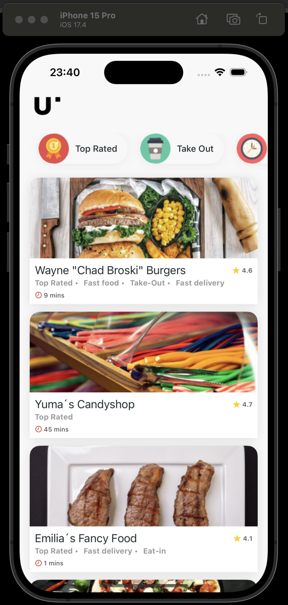

# Restaurant App
- iOS app or for iPhone

<!---->

## Description
- Presents a list of restaurants, and relevant informtion about each of them
- A user can see details of the restaurant, e.g. the various tags, rating, and open/closed status on the restaurant's detail page

## Features
- View a vertical list of restaurant, and each list element is a card presenting restaurant info.
- Horizontal scrolling filters, and vertical scrolling cards
- Cards displaying - restaurant image, name, available filters, rating and delivery time
- Filter restaurants based on Top-Rated, Take-Away and Fast Delivery
- Sorting of the restaurants, as per their rating and delivery time
- Detail page also indicates open/close status of the restaurant

## Version details for App
- Swift 5
- iOS 17+

## To run the App in Xcode
- Download or clone this project to your Mac
- Open project using Xcode, with iOS17 installed in Xcode
- Press the play button
